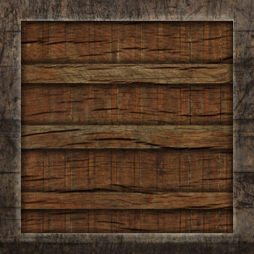

#### 光照贴图

-------

实际物体由许多部分组成，所以前面建立的“材质模型”是远远不够的，所以我们需要扩展前面的系统。

我们要介绍diffuse(漫反射)和specular(镜面)贴图。它们允许你对一个物体的diffuse（而对于简洁的ambient成分来说，它们几乎总是是一样的）和specular成分能够有更精确的影响。

#### *漫反射贴图*

这可能听起来极其相似，坦白来讲我们使用这样的系统已经有一段时间了。听起来很像之前谈论的**纹理贴图**，它基本就是一个纹理。**我们其实是使用同一个潜在原则下的不同名称**：使用一张图片覆盖住物体，以便我们为每个原始像素索引独立颜色值。在光照场景中，通过纹理来呈现一个物体的diffuse颜色，这个做法被称做**漫反射贴图(Diffuse texture)**(因为3D建模师就是这么称呼这个做法的)。

比如这个带有一圈钢圈的木箱贴图，作为漫反射贴图:

着色器中使用漫反射贴图和纹理教程介绍的一样。这次我们把纹理以sampler2D类型储存在Material结构体中。我们使用diffuse贴图替代早期定义的vec3类型的diffuse颜色。

*注意*

要记住的是sampler2D也叫做模糊类型，这意味着我们不能以某种类型对它实例化，只能用uniform定义它们。如果我们用结构体而不是uniform实例化（就像函数的参数那样），GLSL会抛出奇怪的错误；这同样也适用于其他模糊类型。